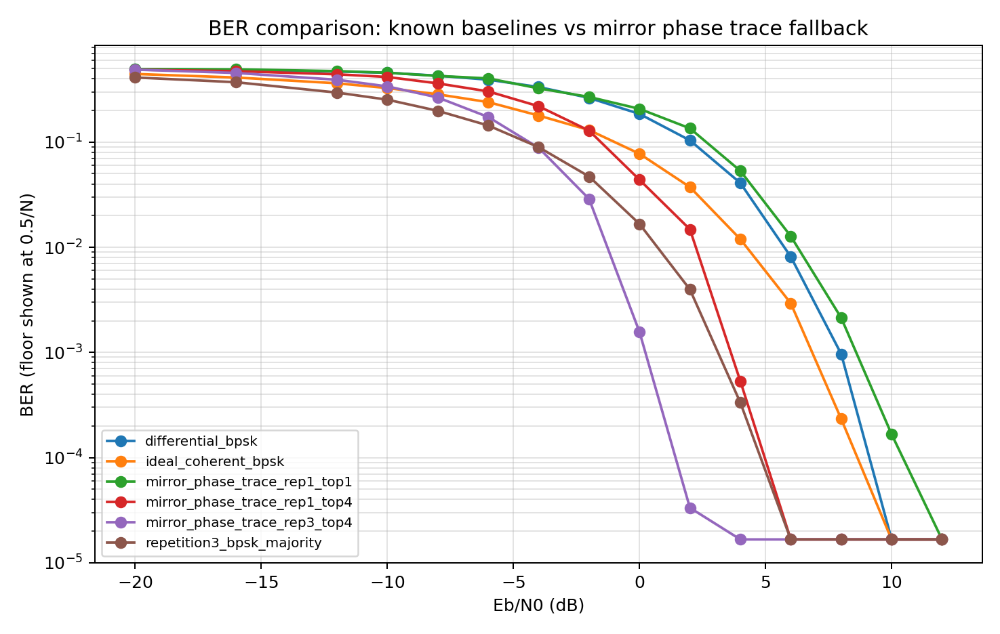
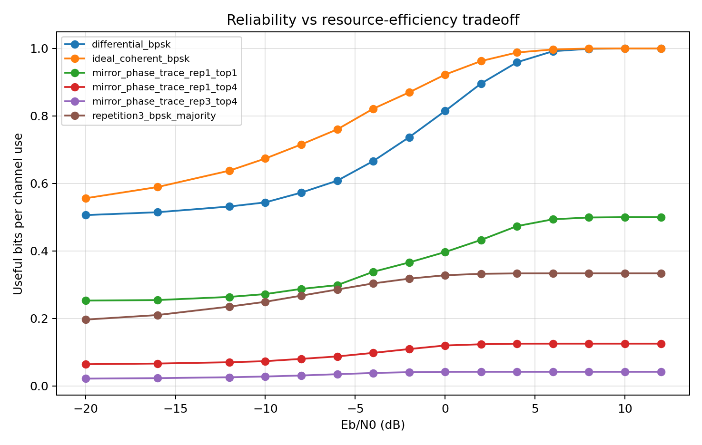
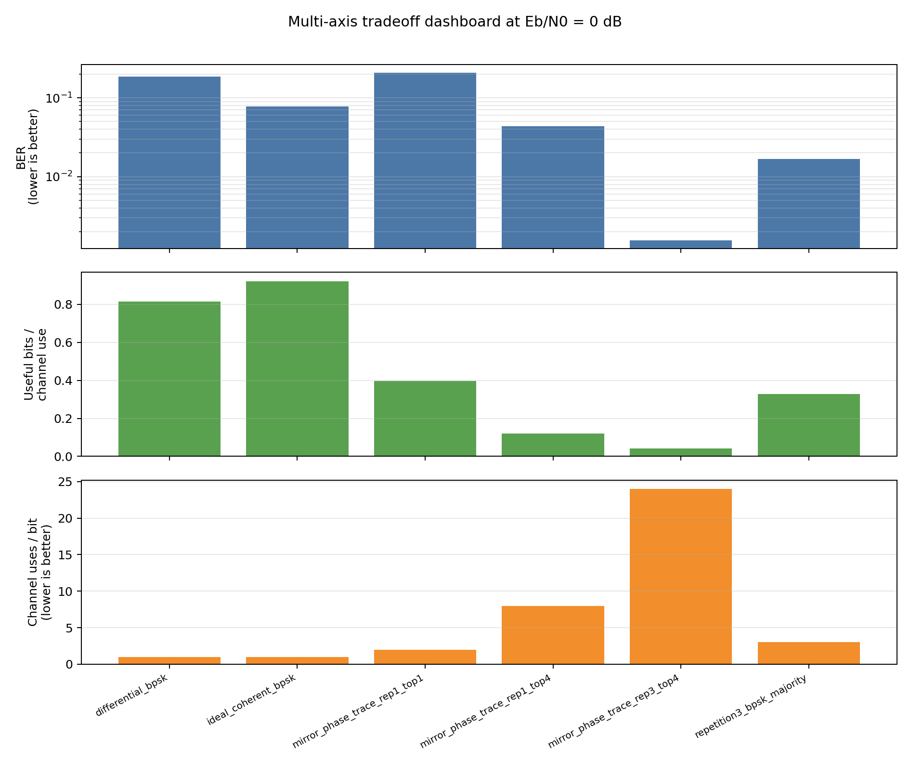
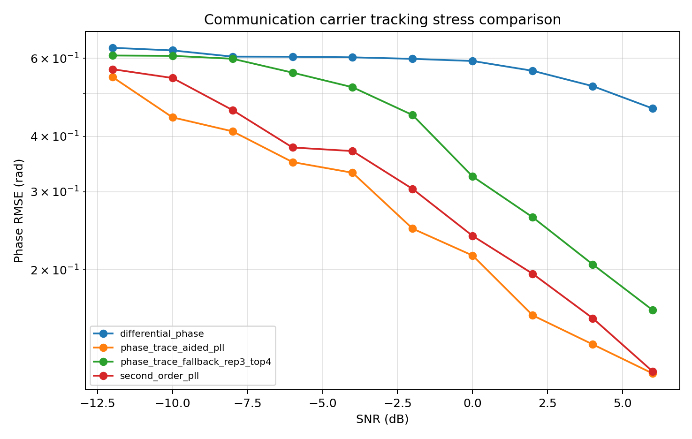
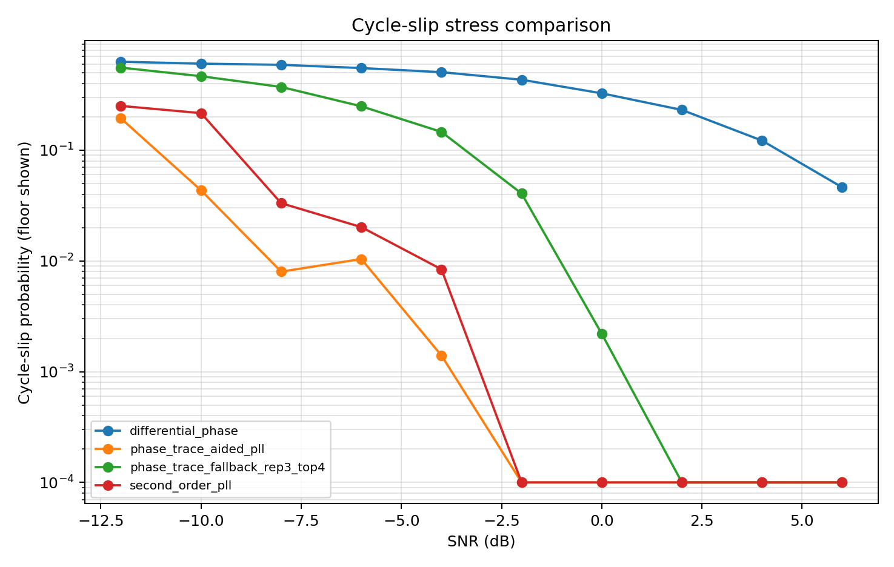
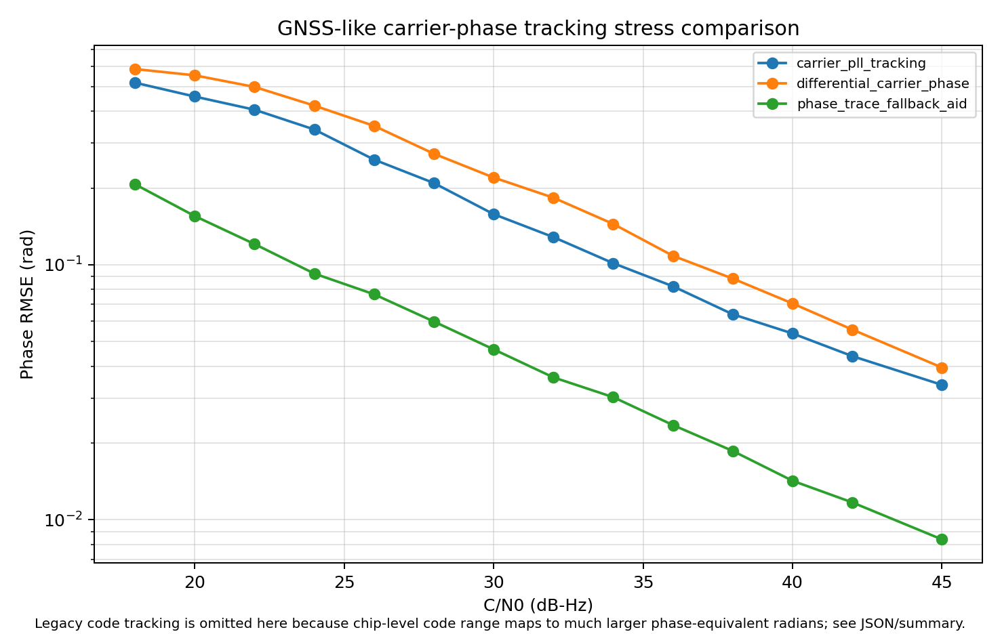
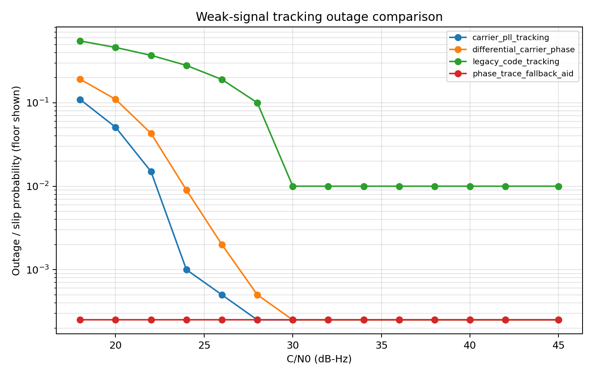

# Phase Trace PoC: Common Phase Fluctuation Cancellation

This folder is a GitHub-ready, minimal public package for explaining and reproducing a **proof of concept for deterministic common phase fluctuation cancellation** using a mirror-subcarrier phase-trace fallback method.

The package is intentionally conservative.  It does **not** claim to replace a complete 5G/6G PHY, GPS/GNSS receiver, or positioning system.  It isolates a narrower technical question: whether a phase-trace observable can preserve phase continuity by canceling common phase rotation in weak-signal or high-variation conditions where ordinary phase tracking becomes unreliable.

## Files

```text
Frequency/Github/
├── README.md
├── requirements.txt
├── src/
│   ├── known_tech_comparison.py
│   ├── comm_pll_cycle_slip_comparison.py
│   └── gps_phase_tracking_comparison.py
└── outputs/
    ├── ber_comparison.png
    ├── resource_efficiency_comparison.png
    ├── tradeoff_dashboard_0db.png
    ├── comm_phase_rmse_comparison.png
    ├── comm_cycle_slip_comparison.png
    ├── comm_pll_tracking_results.json
    ├── comm_pll_tracking_summary.md
    ├── comparison_results.json
    ├── comparison_summary.md
    ├── gps_phase_rmse_comparison.png
    ├── gps_outage_comparison.png
    ├── gps_phase_tracking_results.json
    └── gps_phase_tracking_summary.md
```

## Quick Start

Run from the workspace root:

```bash
python Frequency/Github/src/known_tech_comparison.py
python Frequency/Github/src/comm_pll_cycle_slip_comparison.py
python Frequency/Github/src/gps_phase_tracking_comparison.py
```

The script writes all outputs into:

```text
Frequency/Github/outputs/
```

## What Is Compared

The BER/resource script compares compact, readable reference schemes and several mirror-trace resource settings:

| Scheme | Role |
|---|---|
| `ideal_coherent_bpsk` | Best-case low-order coherent reference with known carrier phase. |
| `differential_bpsk` | Known noncoherent differential baseline that avoids absolute phase tracking. |
| `repetition3_bpsk_majority` | Simple robustness baseline using repetition and majority vote. |
| `mirror_phase_trace_rep1_top1` | Minimum-resource mirror-subcarrier conjugate-product setting. |
| `mirror_phase_trace_rep1_top4` | Intermediate setting using 4 selected mirror pairs and 1 repetition. |
| `mirror_phase_trace_rep3_top4` | Conservative fallback setting using 3 repetitions and 4 selected mirror pairs. |

The communication PLL script separately compares `second_order_pll`, `phase_trace_aided_pll`, `differential_phase`, and `phase_trace_fallback_rep3_top4` for phase RMSE and cycle-slip probability.

## Generated Figures

The generated images are intentionally included in this folder so that a GitHub reader can understand the result before reading the code.

### BER comparison



`outputs/ber_comparison.png`

This figure shows bit error rate versus `Eb/N0`, including extreme low-SNR stress points down to `-20 dB`.  It is useful for showing whether a method can keep a low-rate stream decodable under noisy conditions.

A plotted BER floor or a table value of `0.000000` means **zero observed errors in the finite Monte Carlo run**, not a mathematical proof that the true error probability is zero.

### Resource-efficiency comparison



`outputs/resource_efficiency_comparison.png`

This figure shows useful bits per channel use.  It is essential because the mirror phase trace fallback spends more channel resources per information bit.  The intended argument is not “always faster”; it is “more robust as a fallback path when the normal path is unreliable.”

### Multi-axis tradeoff dashboard



`outputs/tradeoff_dashboard_0db.png` summarizes three complementary axes at `Eb/N0 = 0 dB`: finite-run BER, useful bits per channel use, and channel uses per bit.  This figure is useful for public explanation because it shows that the conservative mirror-trace mode is not a universal throughput winner; it is a fallback configuration that trades channel-resource cost for weak-signal reliability.

The baselines in this dashboard are intentionally simple and explicit: ideal coherent BPSK with known carrier phase, differential BPSK, and repetition-3 majority decoding.  They are not full PLL, LDPC/FEC, HARQ, MIMO, scheduler, or standard-compliant 5G NR receiver models.  The lower panel measures channel uses per information bit, not wall-clock runtime, FFT complexity, or convergence time.

Safe reading: at this stress point, conservative mirror tracing can reduce finite-run BER by spending substantially more channel resources.  Unsafe reading: this figure proves universal superiority over complete commercial receivers or standard carrier-tracking loops.

### Communication PLL / cycle-slip stress comparison



`outputs/comm_phase_rmse_comparison.png` compares phase tracking error for a simple second-order PLL, a phase-trace aided PLL, adjacent-symbol differential phase tracking, and a conservative mirror phase-trace fallback aid under a common phase-dynamics stress model.



`outputs/comm_cycle_slip_comparison.png` compares the finite-run probability that wrapped phase error exceeds the stress-model slip threshold.  This is the right place to discuss PLL loss-of-lock or cycle-slip behavior, because the baseline is explicitly a carrier-tracking loop rather than a generic BER reference.

The key comparison is not only “fallback versus PLL.”  It also includes `phase_trace_aided_pll`, which keeps a PLL-like loop structure but injects a confidence-weighted phase-trace discriminator as an auxiliary phase observation.  This is the appropriate PoC for the question: can the phase-trace concept improve an existing carrier-tracking loop rather than merely bypass it?

Important caveat: this is still a compact PoC.  `second_order_pll` is a simple static-gain reference, and `phase_trace_aided_pll` is a concept-level loop assisted by a confidence-weighted phase-trace discriminator; neither is an optimized commercial receiver loop.  The plots isolate the phase-tracking question and do not include coding, pilots/DMRS design, equalization, MIMO, HARQ, scheduler behavior, RF impairment closure, or fixed-point DSP implementation.


## Resource Setting Sensitivity

The mirror trace method has an explicit reliability/resource dial.  The script now plots three mirror-trace settings:

| Scheme | Pairs | Repetitions | Channel uses / bit | Interpretation |
|---|---:|---:|---:|---|
| `mirror_phase_trace_rep1_top1` | 1 | 1 | 2 | Minimum-resource setting.  Efficiency improves, but BER is much weaker in the current stress model. |
| `mirror_phase_trace_rep1_top4` | 4 | 1 | 8 | Middle setting.  Better BER from pair diversity, lower efficiency than 1-pair mode. |
| `mirror_phase_trace_rep3_top4` | 4 | 3 | 24 | Conservative robust setting.  Strong BER, intentionally low resource efficiency. |

This is important for external explanation.  The low efficiency of `rep3_top4` is not an inherent proof that the method must always be slow; it is the cost of a conservative fallback configuration.  However, the opposite claim is also unsafe: `rep1_top1` is not automatically “low-cost and high-reliability.”  In the current Monte Carlo stress model, `rep1_top1` raises useful bits per channel use, but it loses much of the BER advantage.

A safe public statement is:

> The method exposes a tunable tradeoff between resource use and weak-signal reliability.  Conservative settings use pair diversity and repetition for robust fallback; lighter settings improve efficiency but must be validated against the target outage and BER requirement.

## Adaptive Processing Note

The current simulation uses static mirror-trace settings so that the reliability/resource tradeoff is easy to reproduce and inspect.  In particular, `mirror_phase_trace_rep3_top4` is a conservative stress-test setting, not a claim that every practical receiver must always use the maximum number of pairs and repetitions.

A practical implementation can expose an adaptive processing controller.  For example, signal confidence metrics such as trace-vector magnitude, pair consistency, pilot/DMRS quality, estimated phase-noise rate, or recent error/outage history can decide whether to stop after a lighter setting or escalate to more pairs and repetitions.  This can reduce average computational load and channel-resource use when the signal is already reliable, while preserving the conservative fallback threshold for weak-signal cases.

A safe public statement is:

> This simulation uses static conservative settings for reproducibility.  Practical implementations may use confidence-based adaptive processing to reduce average computation and resource use, but any such controller must be validated against the target BER and outage requirements.

## Core Mirror Trace Operation

The mirror trace receiver computes:

```text
trace_vector = y[k] * conj(y[N-k])
```

If both subcarriers share a common phase rotation `exp(j theta)`, then the common phase ideally cancels:

```text
(h[k] x[k] exp(j theta)) * conj(h[N-k] x[N-k] exp(j theta))
= h[k] conj(h[N-k]) x[k] conj(x[N-k])
```

The demo then removes static pair bias with a known channel/probe estimate and combines several pair/repetition vectors before hard decision.

This is not a probabilistic trick.  The reason the fallback can be robust in the toy model is that the intended `0/pi` phase trace is aligned before summation, while random noise and random phase disturbances tend to add less coherently across selected mirror pairs and repetitions.  In other words, the decisive step is **complex-vector combining before hard decision**, not independent hard decisions followed by a fragile vote.

## Important Caveats

- The script is a reproducible explanation model, not a standard-compliant 5G NR simulator.
- `BER=0` in the table means no errors were observed for the configured number of simulated bits.  It should be written as “below the finite-run resolution” in external explanations.
- High-SNR coherent detection remains the primary path when synchronization is reliable.
- The mirror-pair product creates signal-noise and noise-noise cross terms, so it can carry a penalty relative to ideal coherent detection.
- The intended use is fallback control or low-rate signaling under degraded synchronization, NLOS, shielding, phase noise, or common phase rotation.
- Extremely low-SNR points such as `-20 dB` are stress-test points for visualization; practical operation would require link budget, coding, frame design, and outage criteria.
- Real implementation still requires pilot/DMRS design, FEC, HARQ, scheduler integration, ICI testing, RF impairment testing, and fixed-point/DSP evaluation.


## GNSS-like Phase-Observable PoC

GPS/GNSS is different from the OFDM-style mirror-subcarrier setting.  Legacy GPS L1 C/A is a spread-spectrum ranging signal, not a multicarrier OFDM waveform.  Therefore this repository must not be read as a full GPS/GNSS performance comparison, a positioning accuracy benchmark, or a drop-in replacement for existing receiver processing.

The GNSS-like script is deliberately framed as a **phase-observable proof of concept**.  It extracts one technical issue only: whether a phase-trace style observable can deterministically cancel common phase variation and preserve weak-signal phase continuity in a simplified stress model.

The relevant question is narrower:

> Could a phase-trace style auxiliary channel or future multitone/multi-correlator aid help preserve weak-signal phase continuity when ordinary carrier tracking becomes unreliable?

Out-of-scope items include satellite orbit errors, ionospheric/tropospheric delay modeling, receiver clock estimation, multipath channel estimation, navigation message processing, acquisition, positioning solution geometry, standards compliance, and product-level receiver accuracy.  Those issues are essential for real GNSS systems, but they are intentionally outside this PoC.

Run:

```bash
python Frequency/Github/src/gps_phase_tracking_comparison.py
```

Generated figures:



`outputs/gps_phase_rmse_comparison.png` compares phase RMSE versus `C/N0`.



`outputs/gps_outage_comparison.png` compares weak-signal outage or cycle-slip probability.

Compared rows:

| Scheme | Meaning |
|---|---|
| `legacy_code_tracking` | Robust but coarse pseudorange/code tracking reference. |
| `carrier_pll_tracking` | Fine carrier phase tracking, but vulnerable to loss of lock/cycle slips under weak signal or high dynamics. |
| `differential_carrier_phase` | Adjacent-epoch differential carrier phase reference. |
| `phase_trace_fallback_aid` | Auxiliary/future phase-trace aid channel using pair/repetition vector combining. |

Important caveat: `phase_trace_fallback_aid` should be described as an auxiliary or future GNSS-compatible signal design idea, not as something that can be inserted into legacy GPS L1 C/A without waveform, receiver, and standards-level changes.

## Suggested GitHub Repository Description

```text
Reproducible Python proof-of-concept figures for common phase fluctuation cancellation using a mirror-subcarrier phase-trace observable.
```

## Suggested Public Wording

Use wording like:

> This repository provides a compact simulation and visualization package for exploring a mirror-subcarrier phase-trace fallback path.  The method is intended for low-rate control or emergency signaling when ordinary coherent operation is degraded, not as a replacement for a complete 5G/6G PHY.

For the GNSS-like script, use wording like:

> This is a phase-observable proof of concept, not a full GPS/GNSS receiver or positioning-system benchmark.  It tests whether common phase variation can be canceled in a simplified weak-signal phase-tracking stress model.

Avoid wording like:

> This outperforms 5G.

or:

> This replaces OFDM coherent detection.

or:

> This outperforms GPS/GNSS.

## Reproducibility

The script uses a fixed seed and writes both figures and raw JSON results.  To inspect exact values, open:

```text
outputs/comparison_results.json
outputs/comparison_summary.md
outputs/comm_pll_tracking_results.json
outputs/comm_pll_tracking_summary.md
```

## License and Patent Notice

No open-source license is granted at this time.  All rights are reserved until the patent and licensing strategy is finalized.

The source code and figures are provided for review, educational discussion, and research evaluation only.  The theoretical framework, algorithms, and methods demonstrated in this repository may be covered by pending patent applications.  Commercial use, product integration, redistribution, or sublicensing may require a separate written license agreement.

For research collaboration, patent licensing, or commercial inquiries, please contact: gomemoapp [at] gmail.com